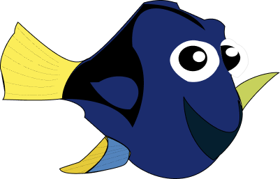

Pop-up fiske billede:
HTML-element til pop-up vinduet (index.html)
Under kommentaren "tilføje fisk billederne til pop-up" ligger et tag som bruges til at vise billedet af den fisk, som brugeren klikker på.

I index.js har jeg tilføjet:
//får fiskebilledets kilde
const ImageSrc = el.src;
document.getElementById("fish-image").className = "fishImg " + id;
Den første linje henter fiskens billede og den anden opdaterer klassens styling.

Tilføjelse af styling i style.css til ".fishImg {}" klasse så fiskebillederne viser korrrekt i pop-uppen.
Opdateret layoutet under:
.popupContent {}
/_ gør for rektangel at være en cirkel _/
Så formen skifter fra en rektangel til en cirkel.

Nye fisk: Dory i index.html

Dette ligger sammen med de andre fisk i 

Tilføjelse af styling i style.css af Dory som en klasse ".fish8 {}" .  
Tilføjelse af fiskedata for Dory i index.js under "const fishInfo = {}"

Ny AI lydfiler:
Nye AI lydfiler for fiskerne med konvertering fra .wav til .mp3
Lydfilerne indlæser via index.js under kommentaren:
//Opretter et lyd-objekt og tildeler source til den specifikke lydfil i mappen "sound"
const soundCrab = new Audio();
soundCrab.src = "sound/krabbe-new.mp3";

"SPIL MED MIG"
Knappen "SPIL MED MIG" tilføjer den rigtig fisk til spillet.
index.js:
// Tilføj lytter til spilleknap for at sende den valgte fisk videre
window.location.href = `game.html?fish=${selectedFishId}`;
I game.js:
// Get the selected fish id from URL
const selectedFishId = urlParams.get("fish");
if (selectedFishId) {
dodger.style.backgroundImage = `url("img/${selectedFishId}.png")`;
}
Spillet henter automatisk den vælgte fisk direkte fra linket i game.html og bruger den til at vise den rigtig fisk i spillet.

"TILBAGE TIL AKVARIET"
Når spilleren vinder vises en vinderskærm med knappen "Tilbage til akvariet"
game.html:
<a href="index.html" id="backButton">TILBAGE TIL AKVARIET</a>
game.js:
Knappen ligger ind i #winScreen som bliver vist når spilleren ramme "finish".
//win screen function
function showWinScreen() {
const screen = document.getElementById("winScreen");
screen.classList.remove("hidden");
startConfetti();
}
game.css (under kommentaren)
/_ Styling for win screen og TILBAGE TIL AKVARIET knap _/

Ny konfetti-effekt:
game.js:
// Start confetti function
function startConfetti() {}
Den funktion tænder konfetti effekten.
function showWinScreen() {}
Den funktion viser vinderskærmen og starter konfettien.
game.html:

Et link fundet via google som henter konfetti scrriptet.
